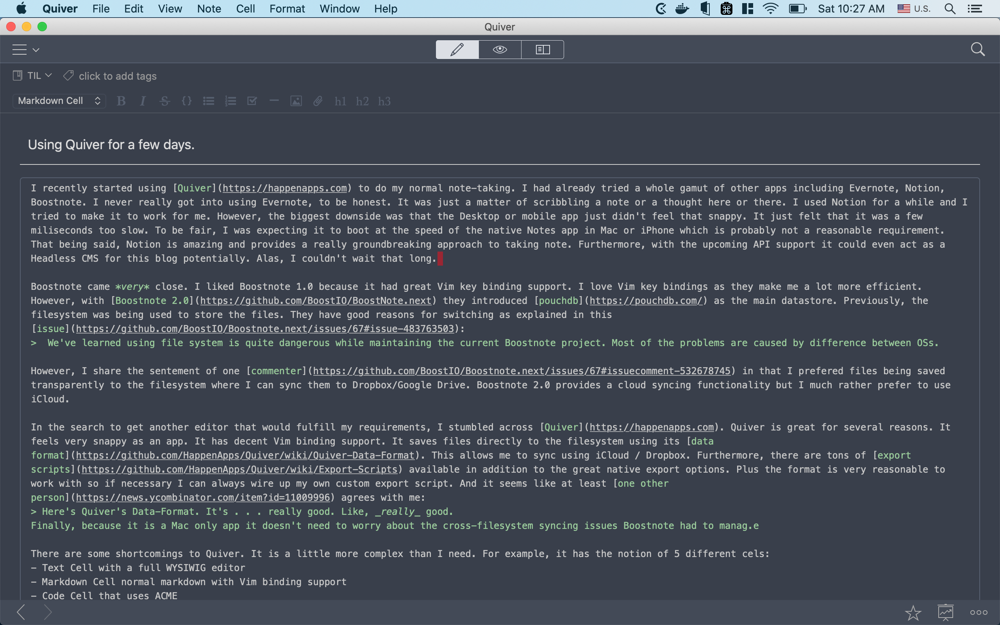

---
Note taking in Quiver
date: "2020-04-04T15:34:24.481Z"
description: My experience using Quiver for writing and note taking
state: published
tags:
  - Writing Tips
  - Quiver
---

# Note taking in Quiver

I recently started using [Quiver](https://happenapps.com) to do my normal note-taking. I had already tried a whole gamut of other apps including Evernote, Notion, and Boostnote. I never really got comfortable using Evernote, to be honest. It never went beyond scribbling a note here, a thought there.

## Notion

I used Notion for a while and I tried to make it work for me. However, the biggest downside was that the Mac and iPhone app just didn't feel that snappy. It just felt that it was a few milliseconds too slow. To be fair, I was expecting it to boot at the speed of the native Notes app in Mac or iPhone which is not a reasonable comparision. Notion is amazing and provides a groundbreaking approach to taking notes. Furthermore, with the upcoming API support, it could even act as a Headless CMS for this blog. Alas, I couldn't wait that long.

## Boostnote

Boostnote came *very* close. I liked Boostnote 1.0 because it had great Vim key binding support. However, with [Boostnote 2.0](https://github.com/BoostIO/BoostNote.next) they introduced [pouchdb](https://pouchdb.com/) as the main data store. Previously, the filesystem was being used to store the files. They have good reasons for switching as explained in this [issue](https://github.com/BoostIO/Boostnote.next/issues/67#issue-483763503):
> We've learned using the file system is quite dangerous while maintaining the current Boostnote project. Most of the problems are caused by the differences between OSs.

However, I share the sentiment of one [commenter](https://github.com/BoostIO/Boostnote.next/issues/67#issuecomment-532678745) in that I preferred files being saved transparently to the filesystem where I can sync them to Dropbox/Google Drive. Boostnote 2.0 provides a cloud syncing functionality but I much rather use iCloud.

## Quiver

In the search to get another editor that would fulfill my requirements, I stumbled across [Quiver](https://happenapps.com). It sounded very promising as it markets itself as `The Programmer's Notebook`. Turns out it was a perfect fit me. Firstly, it feels very snappy as an app. It has decent Vim key binding support. It saves files directly to the filesystem using its [data format](https://github.com/HappenApps/Quiver/wiki/Quiver-Data-Format). This allows me to sync using iCloud / Dropbox. Furthermore, there are tons of [export scripts](https://github.com/HappenApps/Quiver/wiki/Export-Scripts) available in addition to the great native export options. Plus the format is very reasonable to work with so if necessary I can always wire up a custom export script. And it seems like at least [one other person](https://news.ycombinator.com/item?id=11009996) agrees with me:
> Here's Quiver's Data-Format. It's . . .  really good. Like, _really_ good.

Finally, because it is a Mac-only app it doesn't need to worry about the cross-filesystem syncing issues Boostnote had to manage.

There are some cons with Quiver. It is a little more complex than I need. For example, it has 5 different [cells](https://github.com/HappenApps/Quiver/wiki/Getting-Started#2---cell-types):

- Text Cell with a full WYSIWIG editor
- Markdown Cell normal markdown with Vim binding support
- Code Cell that uses ACME
- Latex Cell
- Diagram Cell

I only use the markdown block (I tend to put my code samples in the markdown block) so I don't need all the other blocks. Thankfully, Quiver has the option to set the default cell type which I quickly set as Markdown. Though I do plan to explore the [Diagram cell](https://github.com/HappenApps/Quiver/wiki/Getting-Started#diagram-cell) further in the future.

Furthermore, there is some cool [theming support](https://github.com/HappenApps/Quiver/wiki/Themes). After trying a few custom ones I settled on the official `spacegray` theme. Doesn't this interface look beautiful:

Yup. I am a fan. Thank you for reading.
