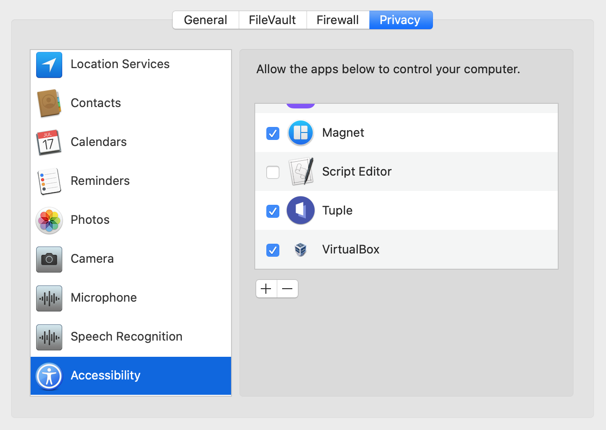

---
Vim tip for Quiver
date: "2020-04-05T16:19:41.108Z"
description: Enable navigating around wrapped lines using vim commands in Quiver
state: published
tags:
  - Writing
  - Quiver
---

# Vim tip for Quiver

## Navigating wrapped lines using Vim

I was finding myself struggling to navigate between long wrapped lines in Quiver using Vim's `j` and `k` commands. Text, as opposed to code, can have long physical lines. I could break them up by add a line break after every period but that feels strange. While perusing the Quiver wiki I landed on the [Vim section](https://github.com/HappenApps/Quiver/wiki/Vim). There was my answer:
> Quiver has line wrapping turned on by default (src). To get j and k working normally, either use `:set nowrap` or `:map j gj` and `:map k gk`.

I applied the keymap and it worked beautifully. I also learned about Vim's `gj` option for the first time. Here is the [documenation](https://vim.fandom.com/wiki/Move_cursor_by_display_lines_when_wrapping) if you are interested.

## AppleScript

The next problem was that the map commands were not being persisted. At every restart, I would have to retype `:map j gj` and `:map k gk`. The docs came in handy again and pointed me to this [applescript](https://github.com/YangVincent/dotfiles/blob/master/quiver/Quiver.scpt). The script would programmatically open Quiver and type in those commands. I modified the script to [my preferences](https://github.com/JibranKalia/dotfiles/blob/9782384c4166a03e6ec0b44690970b92911b3b31/quiver/Quiver.scpt). Gave it the correct access permissions for an executable via `chmod 755 Quiver.sh` and ran it.

## Accessability Permissions

I got the following error:
`execution error: System Events got an error: osascript is not allowed to send keystrokes. (1002)`.

Turns out my Script Editor didn't have enough permissions. So I went under System Preferences > Security & Privacy > Privacy > Accessibility and checked the box.



However, I wasn't done yet. I ran `./Quiver.sh` again and got the same permission error. After some research, I realized I needed to give [iTerm](https://www.iterm2.com/) those same permissions. This is because I was using iTerm to run the script. I gave it those permissions and it worked without errors. However, Quiver's vim mode started acting weird. Turns out I needed to (programmatically) press `Return` between the two map calls. I modified my [script](https://github.com/JibranKalia/dotfiles/commit/ee67aa07b912005658cc3ee06a136efe5715dcdb) to add `keystroke return` between the two map calls and it worked.

Here is the full applescript:

```osascript
tell application "Quiver"
    activate
end tell

tell application "System Events"
    -- jump to the correct location (split mode pane)
    keystroke tab
    keystroke tab

    -- if we were already in the cell, jump back
    key down {shift}
    keystroke tab
    keystroke tab
    key up {shift}
    delay 0.01


    -- remap vim
    keystroke ":map j gj"
    keystroke return
    keystroke ":map k gk"
    keystroke return
end tell
```

### Handy Alias

The last step was to add an alias so I don't have to remember the full file path to the script. I added this to my `.zshrc`:

```shell
# Quiver
alias quiver='/Users/jibrankalia/dotfiles/quiver/Quiver.sh'
```

I then ran `source ~/.zshrc` so that my current shell picked up the changes. I then typed `quiver` to the shell and voila everything worked.

Thank you for reading.

Credit to [Vincent Yang](https://github.com/YangVincent) for the original script.
